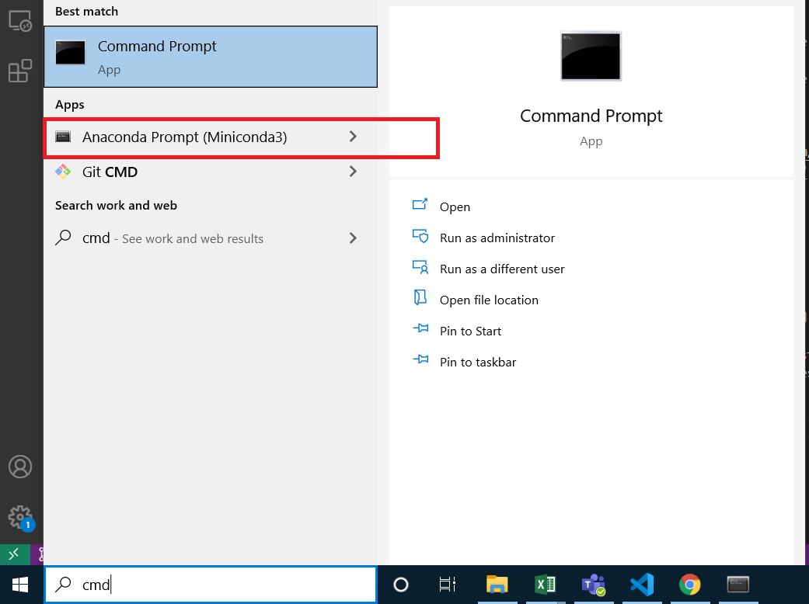
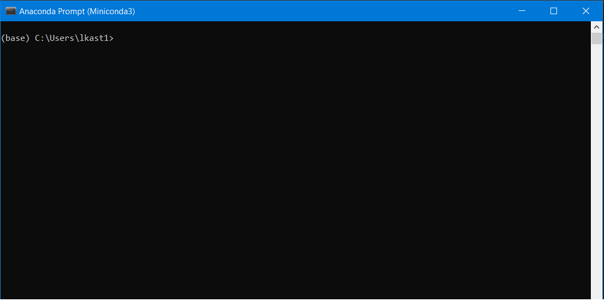
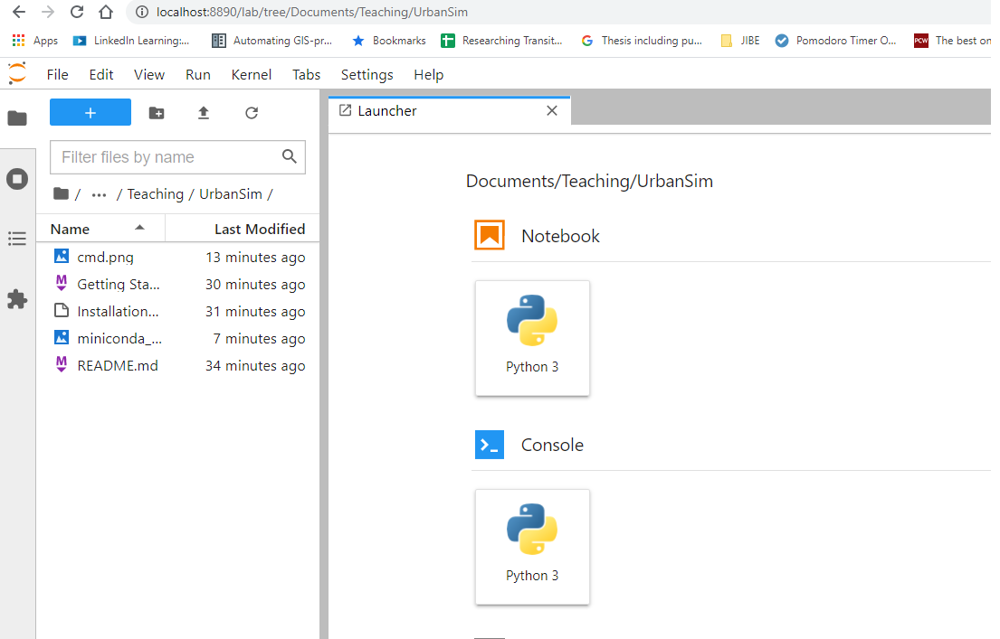
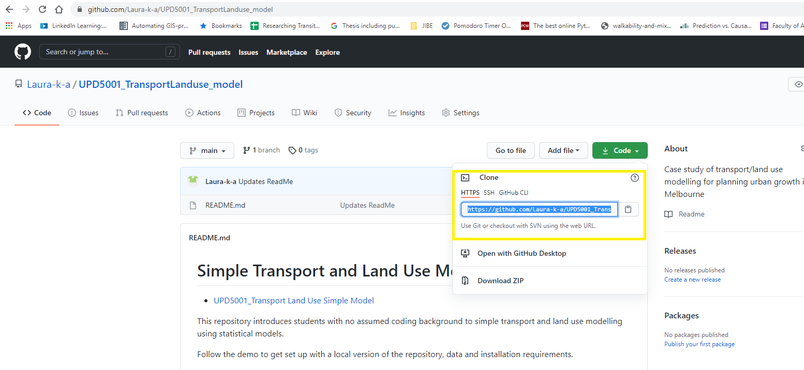
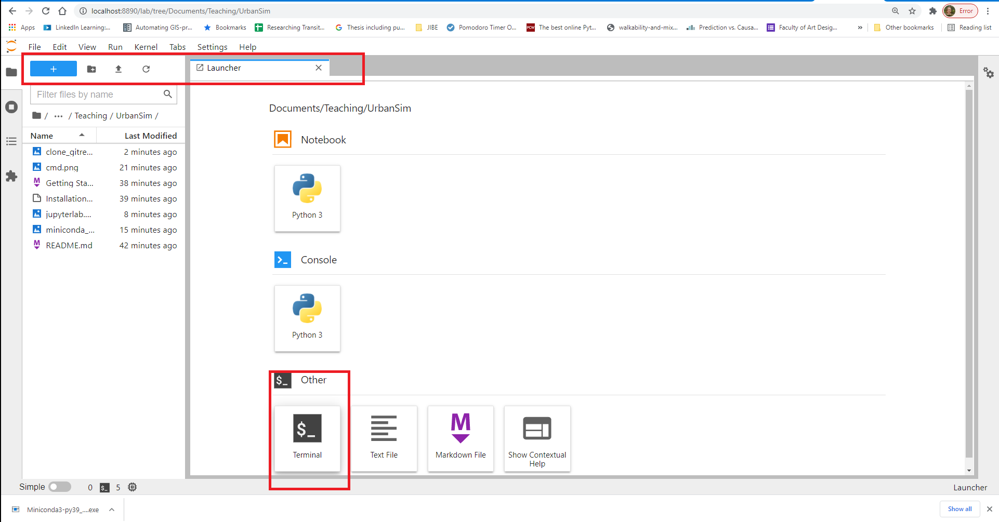
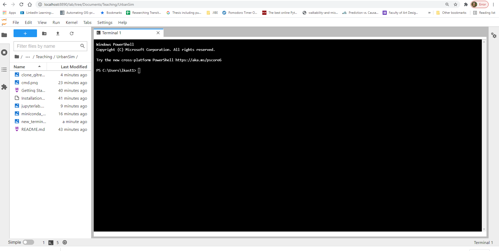

# Getting set up

<!-- TOC -->

- [Getting set up](#getting-set-up)
    - [**Step 1: Install python**](#step-1-install-python)
    - [**Step 2: Install JupyterLab**](#step-2-install-jupyterlab)
    - [***Step 3: Open Jupyter***](#step-3-open-jupyter)
    - [**Step 4: Make a local copy of the data and notebooks for this exercise**](#step-4-make-a-local-copy-of-the-data-and-notebooks-for-this-exercise)

<!-- /TOC -->
## **Step 1: Install python**

I am assuming little to no familiarity with python, so will provide all the code you need. The catch is that I will do so for a particular installation of python, called *Miniconda*. If you are familiar with python and package installations, and prefer to use another distribution, go for it. If not, I suggest installing miniconda, even if you have another python distribution already on your computer. 

**To install** [find the latest  Miniconda package](https://docs.conda.io/en/latest/miniconda.html) for your operating system.

Click on the 'Installer'. It will download an .exe file ot your computer. Click on this - if you don't see it,. check your downloads folder. 

Follow the basic installation procedures. 
Done.


## **Step 2: Install JupyterLab**

Jupyter is a wonderful platform for running interactive code. We will use it to calibrate, map and manipulate simple transport and land use models using the programming language python. 

If you want to understand how the Jupyter platform works, I recommend this [Python Quick Start](https://www.linkedin.com/learning/python-quick-start/advance-your-career-with-python?u=2046060)course, which is taught using Jupyter Notebooks. 

Monash University provides us with a subscription to the course via [LinkedIn Learning](https://www.linkedin.com/learning/me?u=2046060). 


Hold on to your hats because we are going to write a command in the command prompt. What's that, you say? Well, you could [watch this video](https://www.linkedin.com/learning/installing-and-running-ruby-on-rails-5-windows/command-prompt?u=2046060) the understand what the command prompt (or terminal) is, or just follow these instructions and accept the wonders of what goes on in the back end of our computers. 

- Navigate to the Start Menu on your computer
- type 'cmd' (short for 'command' or 'command prompt')
- depending on the software installed on your computer, you will see a few different terminals. Let's open the one associated with the python software we just installed (the Anaconda Prompt for Miniconda)



The command prompt will open. It's a bit intimidating for non-programmers (me!). 



Simple use your keyboard shortcuts to copy and paste this command into your window (ctr+c/ ctr+v; or alternatively you can type it out, paying careful attention to spelling and spaces)

```sh
conda install -c anaconda jupyter
```

Press ENTER

Voila. You have now installed Jupyter.

## ***Step 3: Open Jupyter***

Open the miniconda prompt (if not already open from step 2) type the following:


```sh
jupyter lab
```

Press ENTER

Jupyter Lab will open in your browser. 
Be sure to leave the Comannd prompt running in the background. It is needed to store all the data your will create as you run Jupyter. 




## **Step 4: Make a local copy of the data and notebooks for this exercise**

If you plan to develop your computer programming skills, you will often read (or hear) the instruction to 'clone the repository'. This is what we are going to do now, and it simply means that you will copy all the data (and programming scripts) you need to run a software onto your device, so that you can run it. You are reading this on GitHub, which is the world's open source home of software repositories. Thus, 'cloning' means you will make a local copy of a GitHub repository. 

To clone this repository, navigate to the [main site page](https://github.com/Laura-k-a/UPD5001_TransportLanduse_model).

Click the green 'code' button. You will see a URL (make sure 'HTTPS' is underlined as per the figure below). Copy the URL. 



Open the internet browser tab in which you are running Jupyter Lab. 

Create a new terminal window by selecting the '+' to create a new 'launcher', and then cliking 'terminal' as shown in the figure. 



Now you have a command prompt open in Jupyter Lab



By default, Jupyter will start saving data into your 'user' directory on your computer. You can create folders within the user directory in the normal way. If you want to store this project in a subfolder, create one now. Otherwise, you can just download the data directly into its own folder which will take the name of the github repository (UPD5001_TransportLanduse_model)

Now, if you created a subfolder (perhaps you wish to save it in a folder called 'UPD5001', for example), you need to take an extra step to navigate into this directory. 

In the terminal window within Jupyter Lab, type the following (replace 'UPD5001' with whatever you are calling your folder)

```sh
cd UPD5001
```

All of a sudden, the text that prec

Paste the URL from github. Here it is again:

```sh
https://github.com/Laura-k-a/UPD5001_TransportLanduse_model.git
```

Press ENTER


